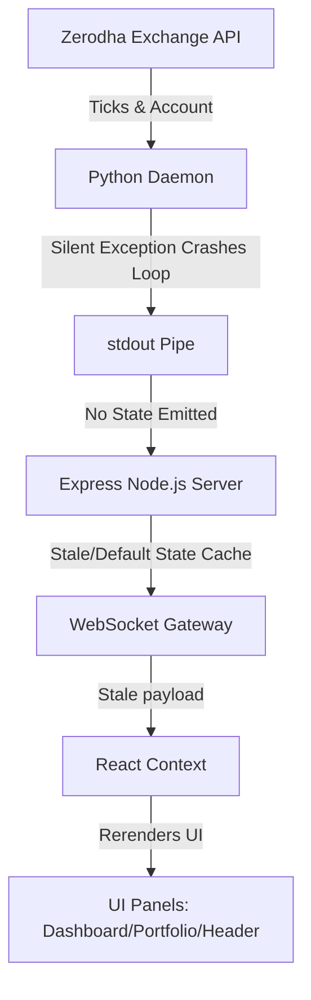
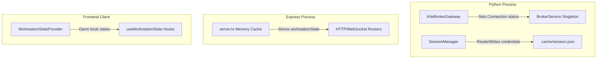
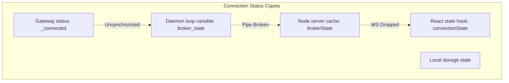
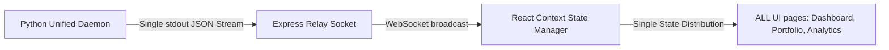

# Runtime Architecture Audit Report

This report presents a senior staff-level runtime architecture audit of the trading workstation, diagnosing why the application exhibits disconnected states, ₹0 portfolios, and static placeholder analytics even after a successful broker connection.

---

## 1. Executive Summary
The workstation displays a successful connection on the Broker page ("Kite session established successfully") but remains disconnected elsewhere because of a **critical breakdown in the background data synchronization pipeline**. Specifically, three major runtime bugs inside the Python daemon loop crash the state serialization process, preventing any state packets from being printed to `stdout`. As a result, the Node.js server never receives updated state objects, causing the React WebSocket client to be starved of live updates and fall back to stale or offline states.

Additionally, **five major UI components violate the Single Source of Truth (SSOT)** design guideline by maintaining their own local React states and fetching data directly via one-off REST API requests on mount instead of subscribing to the unified React Context.

---

## 2. Phase 1: Complete Runtime Tracing
Below is the exact execution flow when a user clicks the **Connect Broker** button on the Broker Integration page:

### Step-by-Step Path
1. **User Action (UI):**
   * The operator enters their credentials on the [BrokerIntegration](file:///e:/AIR/ArdhaMind01/src/frontend/components/BrokerIntegration.tsx) page and clicks the button.
   * *Element:* `<button id="connect-broker-btn" onClick={handleConnect}>`
2. **React Action (Handler):**
   * Triggers the `handleConnect` callback in `BrokerIntegration.tsx`.
   * Invokes the async frontend service wrapper `connectBroker(apiKey, accessToken, ...)` and sets the local state `loginMessage` to `"Connecting to Zerodha Kite gateways..."`.
3. **API Call (HTTP Fetch Client):**
   * The `connectBroker` helper in [broker.ts](file:///e:/AIR/ArdhaMind01/src/frontend/services/broker.ts) sends an HTTP `POST` request to `http://localhost:3000/api/broker/login`.
4. **Express Endpoint (Node Server routing):**
   * Handled by `app.post("/api/broker/login", ...)` in [server.ts](file:///e:/AIR/ArdhaMind01/server.ts).
   * Stores the API key and access token in server process-level variables: `activeApiKey` and `activeAccessToken`.
   * Fires the IPC request `sendDaemonRequest("login", { ... })` and awaits response.
5. **Python Bridge (IPC/Stdin/Stdout):**
   * Writes the request string to `pyDaemon.stdin`.
   * The thread `stdin_reader()` in [server_bridge.py](file:///e:/AIR/ArdhaMind01/src/server_bridge.py) reads the line and dispatches it to `handle_daemon_command()`.
6. **Broker Service (Unified access gateway):**
   * Retrieves the active `KiteBrokerGateway` instance via `bs.get_gateway()`.
   * Invokes `gateway.connect(api_key, access_token)`.
7. **Session Manager (Persistence):**
   * If persistence is enabled, [session_manager.py](file:///e:/AIR/ArdhaMind01/src/broker/services/session_manager.py) writes session credentials into `.cache/session.json`.
   * Returns a success response JSON to the Node server.
8. **Daemon Process Restart:**
   * Upon receiving a successful login response from the daemon command, `server.ts` terminates the old daemon and executes `startPythonDaemon()`. This forces the python daemon to boot up with the updated credentials passed via environment variables (`KITE_API_KEY`, `KITE_ACCESS_TOKEN`).
9. **Workstation State Loop (The Point of Failure):**
   * The newly spawned daemon starts its background loop `run_daemon()` in `server_bridge.py` (executing every 3 seconds).
   * **Failure 1 (Instruments Init):** It attempts to load instruments:
     ```python
     instruments_df = InstrumentManager.get_instruments(bs.get_gateway())
     ```
     This fails because `get_instruments` expects a raw `KiteConnect` object, but receives the adapter class `KiteBrokerGateway` which has no attribute `instruments`. It raises `AttributeError: 'KiteBrokerGateway' object has no attribute 'instruments'` and prints an error log.
   * **Failure 2 (Market Context Compilation):** It attempts to compile market context:
     ```python
     "timestamp": datetime.utcnow().isoformat() + "Z"
     ```
     This fails because the namespace `datetime` has been overwritten inside the file scope by `import datetime`. Calling `.utcnow()` on the module raises `AttributeError: module 'datetime' has no attribute 'utcnow'`.
   * **Failure 3 (NameError):** It attempts to format the workspace reports:
     ```python
     data = generate_dynamic_workspace_data(current_mode, preferred_style, spot_nifty, bs)
     ```
     Inside this function, `ce_allocated_capital` and `pe_allocated_capital` are referenced but **never defined**. Python throws `NameError: name 'ce_allocated_capital' is not defined`.
   * **Result:** The state serialization loop crashes completely. The print statement `print(json.dumps(state_payload), flush=True)` is **never reached**.
10. **WebSocket Broadcast:**
    * Because the daemon stdout is silent, the Express readline interface never receives a `"state"` message type. No WebSocket broadcast is sent to the client.
11. **React Context & UI:**
    * React never receives the updated state payload. The context remains populated with the initial default state (`defaultPortfolioReport`, `defaultBrokerAccount`), showing `KITE_OFFLINE`, ₹0 portfolio, and static fallback market structures.

---

## 3. Phase 2: State Ownership & Identification

The workstation tracks 8 major states. The table below details who owns, updates, and consumes them, along with synchronization weaknesses:

| State | Physical Owner | Updater | Consumer | Duplicated? | Staleness Risk |
| :--- | :--- | :--- | :--- | :--- | :--- |
| **Broker Connection** | `KiteBrokerGateway._connected` | `KiteBrokerGateway.connect()` / `disconnect()` | `BrokerService`, `server_bridge.py` | **Yes** (Gateway state, daemon loop status, Node cache, React Context) | **High** (React shows DISCONNECTED because daemon crashes on status serialization) |
| **Session** | `.cache/session.json` | `SessionManager.save_session()` | `KiteBrokerGateway.load_session()` | **Yes** (Disk, Node memory, Python gateway variables) | **Medium** (If file updates but process is not restarted) |
| **Market Status** | `MarketStatusService` | `MarketStatusService` ticker checks | `server_bridge.py` | **Yes** (Python class memory, Node state cache, React UI) | **Low** |
| **Workspace Mode** | `WorkspaceManager._current_mode` | `WorkspaceManager.set_mode()` | Positions/Orders execution guard | **Yes** (React local storage, Node active mode, Python wm singleton) | **High** (If mode toggles but Python process does not pick up the transition) |
| **Portfolio** | Zerodha Kite Gateway | `LivePortfolioReportBuilder` | `server_bridge.py` | **Yes** (Zerodha server, Python telemetry, Node workstationState, React context) | **High** (Crashes in builders fallback silently to a ₹0 dummy record) |
| **Positions** | Zerodha / Virtual Ledger | `PositionsService` | `LivePortfolioReportBuilder` | **Yes** (Broker, local ledger DB, Express context, React state) | **High** |
| **Holdings** | Zerodha / Virtual Ledger | `HoldingsService` | `LivePortfolioReportBuilder` | **Yes** (Broker, local ledger DB, Express context, React state) | **High** |
| **Market Feed** | `MarketFeedService` | `KiteTicker` WebSocket ticks | `streaming_orchestrator.latest_ticks` | **Yes** (Python ticker dictionary, Node tick cache, React context spot price) | **High** (If WebSocket connection drops, UI ticks freeze without warning) |

---

## 4. Phase 3: Page Verification & Inconsistencies

We inspected all frontend pages to see where they retrieve status, market data, and portfolio reports. Every page reads from the central `WorkstationStateContext.tsx` context using the `useWorkstationState` hook:

1. **Broker Page ([BrokerIntegration.tsx](file:///e:/AIR/ArdhaMind01/src/frontend/components/BrokerIntegration.tsx)):**
   * Obtains status from `portfolioReport?.broker_health` and `connectionState`. Displays "Kite session established successfully" because `brokerAccount.client_id !== ""` (which is fetched once via REST API on login).
2. **Dashboard ([HomeDashboard.tsx](file:///e:/AIR/ArdhaMind01/src/frontend/components/HomeDashboard.tsx)):**
   * Obtains broker status from `portfolio?.broker_health?.connection_status`. Shows `KITE_OFFLINE` because the default/fallback report status is `DISCONNECTED`/`ERROR`.
3. **Header ([DashboardLayout.tsx](file:///e:/AIR/ArdhaMind01/src/frontend/layout/DashboardLayout.tsx)):**
   * Obtains broker status from `portfolioReport?.broker_health?.connection_status`. Displays a persistent `KITE_OFFLINE` warning badge.
4. **Portfolio Page ([LivePortfolio.tsx](file:///e:/AIR/ArdhaMind01/src/frontend/components/LivePortfolio.tsx)):**
   * Reads positions and statistics from `portfolioReport.statistics`. Shows `₹0.00` because the central state is starved.
5. **Trade Center ([ExecutionWorkspace.tsx](file:///e:/AIR/ArdhaMind01/src/frontend/components/ExecutionWorkspace.tsx)):**
   * Reads broker connectivity status to disable/enable trading forms. Remains disabled due to the offline state.

**The Mismatch Reason:** The Broker Integration page validates that a session exists based on the REST-fetched `brokerAccount.client_id`, while the rest of the workstation relies on the continuous WebSocket-streamed `portfolioReport.broker_health.connection_status` (which remains in a crashed, default `DISCONNECTED` state).

---

## 5. Phase 4: WebSocket Payload Analysis

The WebSocket server in `server.ts` broadcasts raw state updates under the `type: "state"` channel. The expected format is:

```json
{
  "type": "state",
  "data": {
    "workspaceContext": {
      "currentMode": "LIVE_PRACTICE",
      "brokerState": "CONNECTED",
      "marketState": "CLOSED",
      "brokerType": "ZERODHA",
      "marketDataSource": "LIVE",
      "executionMode": "PAPER_EXECUTION",
      "portfolioSource": "BROKER",
      "analyticsMode": "ENABLED",
      "timestamp": "2026-07-15T00:13:08Z"
    },
    "brokerAccount": {
      "client_id": "HOM885",
      "client_name": "Trader Name",
      "email": "trader@example.com",
      "broker_name": "Zerodha"
    },
    "brokerFunds": {
      "available_cash": 150000.0,
      "utilized_margin": 0.0,
      "available_margin": 150000.0
    },
    "portfolioReport": {
      "holdings": [],
      "positions": { "net": [], "day": [] },
      "statistics": { "available_cash": 150000.0 },
      "broker_health": { "connection_status": "CONNECTED", "session_valid": true }
    }
  }
}
```

### The Breakdown Point
When the Python daemon throws `NameError: name 'ce_allocated_capital' is not defined`, the loop enters the `except Exception` block in `server_bridge.py`:
```python
except Exception as err:
    logger.error(f"Daemon state generation failed: {err}")
```
As a result:
1. No JSON packet is printed to `sys.stdout`.
2. The Node.js server's `readline` listener never receives a `state` message type.
3. The WebSocket clients never receive any message.
4. The React Context remains initialized with the default `defaultPortfolioReport`, resulting in `connection_status: "DISCONNECTED"` and a zero portfolio.

---

## 6. Phase 5: Inventory of Placeholders & Mock Data

A full project search was performed to locate hardcoded fallbacks and mock data sources:

1. **[news.ts](file:///e:/AIR/ArdhaMind01/src/frontend/services/news.ts):**
   * The function `getNewsSentiment()` bypasses all real market APIs and returns `mockNewsSentimentContext`.
2. **[analytics.ts](file:///e:/AIR/ArdhaMind01/src/frontend/services/analytics.ts):**
   * The function `getAnalyticsReport()` bypasses real trade ledger data and returns `mockAnalyticsReport`.
3. **[mockData.ts](file:///e:/AIR/ArdhaMind01/src/frontend/services/mockData.ts):**
   * Stores static mock arrays for news articles, trade journals, performance statistics, and sentiment indexes.
4. **[server_bridge.py](file:///e:/AIR/ArdhaMind01/src/server_bridge.py):**
   * `generate_dynamic_workspace_data` returns hardcoded numbers for:
     - `market_score`: `score: 78.5`, `strength_pct: 82.5`
     - `opportunity_context`: sector scores, sectoral bias, and trend strength
     - `strategy_evaluation`: momentum, breakout, and mean-reversion suitability percentages
     - `call_cand` / `put_cand`: default premium (145.0/120.0), IVs (14.1/14.5), spreads, bid/ask depths, and lot sizes when no live WebSocket quotes have arrived.

---

## 7. Phase 6: Single Source of Truth Compliance

**Answer:** **NO**

### Violations List
Five major frontend components bypass the central React Context (`useWorkstationState`) and query REST services directly, storing their own local `useState` variables:

1. **[PerformanceAnalytics.tsx](file:///e:/AIR/ArdhaMind01/src/frontend/components/PerformanceAnalytics.tsx):**
   * Imports `getAnalyticsReport` directly.
   * Loads state via `useEffect` on mount into local `[report, setReport]` hook variables.
2. **[NewsIntelligence.tsx](file:///e:/AIR/ArdhaMind01/src/frontend/components/NewsIntelligence.tsx):**
   * Imports `getNewsSentiment` directly.
   * Loads state via `useEffect` on mount into local `[news, setNews]` hook variables.
3. **[MarketStory.tsx](file:///e:/AIR/ArdhaMind01/src/frontend/components/MarketStory.tsx):**
   * Imports `getNewsSentiment` directly.
   * Loads state via `useEffect` on mount.
4. **[ExecutiveSummary.tsx](file:///e:/AIR/ArdhaMind01/src/frontend/components/ExecutiveSummary.tsx):**
   * Imports `getMarketContext`, `getOptionContext`, and `getDecisionReport` directly.
   * Loads state on mount into local variables, completely bypassing WebSocket updates.
5. **[DecisionEngine.tsx](file:///e:/AIR/ArdhaMind01/src/frontend/components/DecisionEngine.tsx):**
   * Imports `getDecisionReport` directly.
   * Loads state via `useEffect` on mount.

---

## 8. Phase 7: Architectural Analysis & Redesign

### Diagrams

#### 1. Architecture Diagram


#### 2. State Ownership Diagram


#### 3. Duplicate State Diagram


#### 4. Broken Synchronization Diagram
```sequenceDiagram
    participant P as Python Daemon Loop
    participant N as Express Node.js
    participant R as React Context
    
    rect rgb(40, 20, 20)
    Note over P: Loop executes run_daemon()
    P->>P: InstrumentManager.get_instruments(gateway)
    Note over P: ERROR: gateway has no attribute 'instruments'
    P->>P: datetime.utcnow()
    Note over P: ERROR: module 'datetime' has no attribute 'utcnow'
    P->>P: generate_dynamic_workspace_data()
    Note over P: ERROR: ce_allocated_capital is not defined
    Note over P: Loop crashes & skips print()
    end
    N->>N: Readline stdout: Waiting... (Timeout)
    Note over N,R: No WebSocket message broadcasted!
    Note over R: Displays initial default 'DISCONNECTED' State
```

---

### Architectural Violations List
1. **Silent Failures on Daemon Pipe:** The daemon loop wraps critical computations (like `LivePortfolioReport.generate`) in catch-all `except Exception: pass` statements. This suppresses execution errors, rendering the system impossible to debug without inspecting raw stdout/stderr logs.
2. **Namespace Overlaps (Contamination):** Importing `datetime` as a module and `from datetime import datetime` class in the same file scopes causes AttributeError exceptions.
3. **Implicit Dependency Coupling:** `InstrumentManager` calls `kite.instruments` directly, expecting a raw client wrapper instead of adhering to the `IBrokerGateway` adapter interface.
4. **Decentralized State Invalidation:** Modes are switched via HTTP POST endpoints, but the Python daemon relies on a separate environment variable checked only on process spawn.

---

### Proposals for a Clean Redesign

Instead of patching individual variables, we propose a **Unified State Stream Redesign**:



1. **Implement Unified JSON State Schema:**
   Merge all dashboard analytics, sentiment scores, and portfolio telemetry into a single, structured schema definition shared between Python and TypeScript.
2. **Remove Component Direct Fetches (Enforce Context Subscription):**
   Refactor `PerformanceAnalytics.tsx`, `NewsIntelligence.tsx`, `MarketStory.tsx`, `ExecutiveSummary.tsx`, and `DecisionEngine.tsx` to read report variables directly from `useWorkstationState()` instead of executing separate fetches on mount.
3. **Unified Bridge State Dispatcher:**
   Create a single error-resistant state compiler in Python that catches inner exceptions individually, logs them to stderr, and guarantees a valid JSON packet is printed to stdout on every cycle.
4. **Gateway Protocol Conformity:**
   Refactor `InstrumentManager` to consume the gateway adapter's conforming `get_instruments()` method, maintaining clean decoupling between the data engine and the Kite Connect client.
5. **Clean datetime Import Declarations:**
   Enforce a single import style `from datetime import datetime` across all Python files and remove namespace overlaps.
