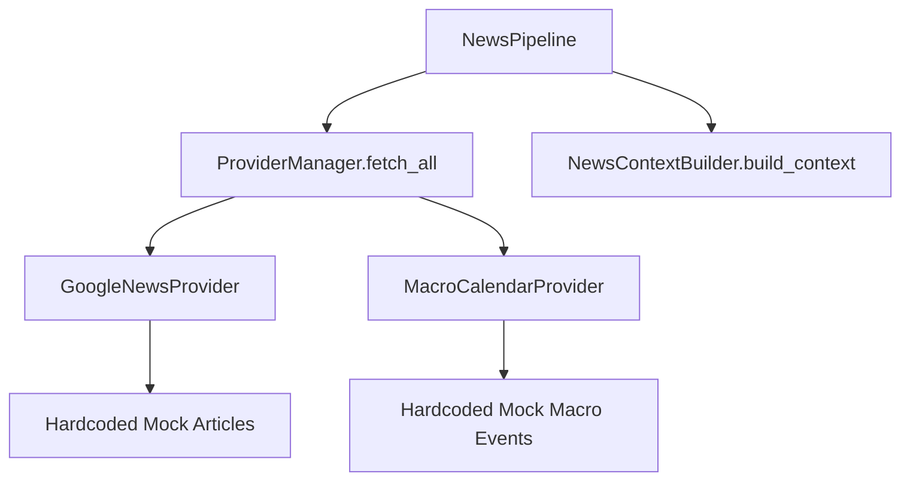

# Phase 5.2 News Runtime Audit

This document reviews the current news runtime, ingestion pipeline, provider systems, and processing models within the `AIR ArdhaMind` repository before embarking on the Phase 5.2 Real News Integration.

## 1. Current Ingestion Architecture

### Ingestion Components
The ingestion engine is defined inside `src/news_engine/provider_manager.py` and orchestrated via `src/pipeline/news_pipeline.py`.

### Active Runtime Providers
- **`GoogleNewsProvider`**: Currently hardcoded to return a fixed list of five financial news headlines (from Economic Times, Moneycontrol, Reuters, Bloomberg, and NSE India).
- **`MacroCalendarProvider`**: Hardcoded to return a list of four macroeconomic scheduled releases (MOSPI CPI, FOMC Statement, MOSPI GDP, EIA Crude weekly).

### Refresh Interval
- Controlled by the daemon main loop in `src/server_bridge.py`. The loop sleep time is set to `3.0` seconds. On every iteration, the daemon executes the full pipeline including the `NewsPipeline`, which triggers `ProviderManager.fetch_all()`.

---

## 2. Text Processing & Analytics Heuristics

### Normalization
- Done in `NewsNormalizer` ([normalizer.py](file:///e:/AIR/ArdhaMind01/src/news_engine/normalizer.py)). Converts RSS / Google News dictionaries and macro calendar entries into normalized internal representations (`article_id`, `title`, `content`, `source`, `published_at`, `url`).
- Replaces/normalizes timestamps using RFC-style email utilities (`parsedate_to_datetime`).

### Deduplication
- Done in `NewsDeduplicator` ([deduplicator.py](file:///e:/AIR/ArdhaMind01/src/news_engine/deduplicator.py)). Uses word-level Intersection-over-Union (IoU) similarity threshold (`0.70` default) and/or exact URL matches to merge duplicate articles.
- Merged items consolidate their `sources` lists, updating the primary source field to a comma-separated list of all duplicate sources.

### Event Classification
- Done in `EventClassifier` ([event_classifier.py](file:///e:/AIR/ArdhaMind01/src/news_engine/event_classifier.py)). Performs keyword matching against predefined categories:
  - `Central Bank`
  - `Inflation`
  - `GDP`
  - `Corporate Earnings`
  - `Geopolitics`
  - `Regulation`
  - `Technology`
  - `Energy`
  - `Global Markets`
- Falls back to `Macro Economy` if no rule matches.

### Sentiment & Market Impact
- Done in `MarketImpactEvaluator` ([impact.py](file:///e:/AIR/ArdhaMind01/src/news_engine/impact.py)).
- Implements simple word-matching sentiment classifier using bullish/bearish lexicons.
- Special contextual logic modifies counts if `oil` or `inflation` are present in the text (e.g., rising oil or sticky inflation are treated as bearish signals).
- Assigns expected direction (`BULLISH`, `BEARISH`, `NEUTRAL`), time horizons (`WEEKLY`, `DAILY`, `INTRADAY`), and lists of affected indices, sectors, and markets.

---

## 3. Storage, Persistence, and Failure Behavior

### Persistence
- There is **no database or disk storage** for news. All processed articles and events are held in memory by the daemon's runtime state.
- Express server (`server.ts`) caches the latest broadcasted state, which it immediately serves to newly connected client WebSockets.

### Failure Handling
- If any provider fails, `ProviderManager.fetch_all()` catches the exception and returns an empty list `[]` for that provider. Unrelated market analytics and option telemetry are unaffected by news ingestion failures.

---

## 4. Frontend Integration & Consumed Fields

- **NEWS & UPDATES** Workspace: Refactored in Phase 5.1 to consume the canonical `news_intelligence` section. Consumes:
  - `items`: Structured list of news articles.
  - `statistics`: Sentiment score and distributions.
- **Today's Analysis**: Displays a text narrative of market dynamics incorporating news.

---

## 5. Identified Gaps for Phase 5.2

1. **No Real Network Ingestion**: The providers currently return mock, static data. We need actual network fetching using real API/RSS URLs with timeouts, retries, and user agents.
2. **Missing Quality/Verification Fields**: No current fields exist for `freshness_status`, `quality_status`, `verification_status`, `nifty_relevance_score`, `impact_strength`, `confidence`, `received_at`, etc.
3. **No Official Sources**: RBI, SEBI, and NSE/BSE announcements are not ingested from official portals.
4. **No UI Deduplication/Grouping**: Front-end does not group or collapse duplicate groups, showing merged comma-separated authors instead.
5. **No Settings/Diagnostics UI**: There is no control interface to check provider health, latencies, items fetched, or to manually trigger refetches.
