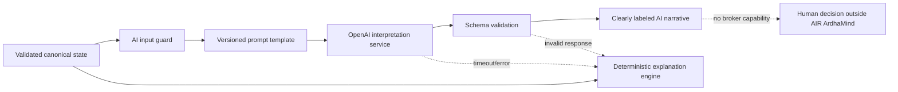

# Bounded AI Integration Boundary

## Principle

**Deterministic engines calculate. AI explains. Human decides.**



## Proposed service interface

Conceptual interface only:

```text
interpret(request: AIInterpretationRequest) -> AIInterpretationResult
```

`AIInterpretationRequest` contains a schema version, requested narrative type, canonical snapshot ID, validated structured engine outputs, provenance, timestamps, warnings and an explicit list of unavailable fields.

`AIInterpretationResult` contains model/provider identity, prompt version, generated time, snapshot ID, narrative sections, cited input field IDs, limitations, token/cost metadata and validation status.

The service exposes no broker, execution, filesystem mutation or raw market-fetch capability.

## Allowed inputs

- Validated canonical market and option contexts
- Deterministic score, opportunity, strategy, confidence and risk outputs
- Source-aware normalized news summaries
- Trade scenarios and invalidation conditions
- Observation and generation timestamps
- Freshness/quality status and warnings

## Allowed outputs

- Market narrative and “Why Today?”
- Option-chain interpretation
- Risk and scenario explanation
- Pre-market briefing
- Intraday situation update
- End-of-day intelligence summary

## Forbidden behavior

- Calculating or inventing prices, IV, OI, levels or quantities
- Converting unavailable inputs into plausible prose
- Producing executable order instructions
- Calling broker methods or endpoints
- Bypassing deterministic blocking/risk outcomes
- Hiding stale or partial input status
- Recommending action when the canonical scenario is blocked

## Prompt ownership and validation

- Prompts live in one versioned application-owned registry, not React components.
- Prompt templates receive JSON data, not unstructured screen text.
- Response is constrained to a versioned JSON schema.
- Every narrative statement must reference canonical input field IDs or be labeled general explanation.
- Schema or citation failure rejects the AI result.

## Failure behavior

- A short bounded timeout returns `AI_UNAVAILABLE`.
- Market calculations continue unaffected.
- The deterministic `explanation_engine/` output is shown and labeled deterministic.
- No mock AI response is substituted.
- Retries use bounded exponential backoff outside the market-state computation loop.

## Caching, audit and cost

- Cache by snapshot ID, prompt version, model and narrative type.
- Never reuse a narrative for a different snapshot.
- Store request metadata and hashed/canonical input references; avoid raw credentials and unnecessary news bodies.
- Log provider, model, latency, token counts, cost estimate, validation result and fallback reason.
- Enforce per-session and daily budgets, maximum tokens and narrative refresh intervals.
- AI refresh should be event-driven by meaningful canonical state changes, not every tick.

