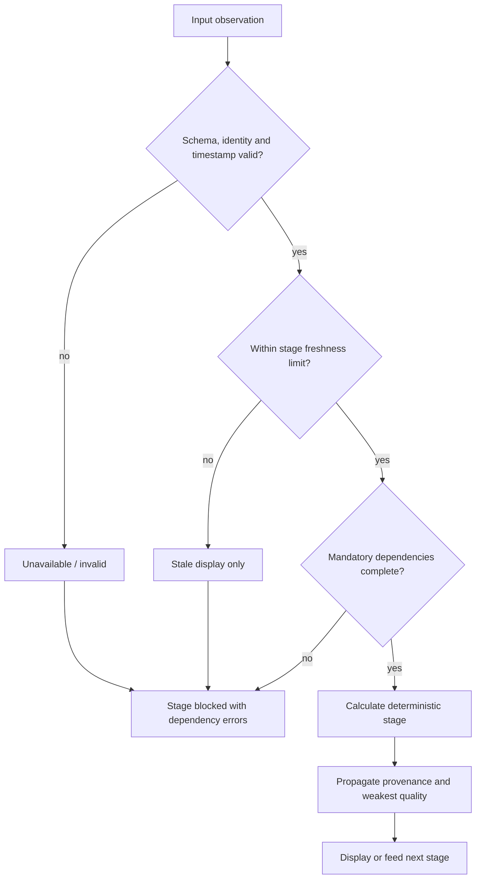

# Data Provenance and Quality Contract

## Field metadata

Every externally displayed market-sensitive field must support:

| Attribute | Meaning |
|---|---|
| `source` | Provider/system of record, e.g. `KITE_TICK`, `KITE_REST`, `CALCULATED` |
| `instrument` | Exchange, symbol and token/contract identity |
| `observed_at` | Time assigned to the source observation |
| `received_at` | Time AIR ArdhaMind received the observation |
| `generated_at` | Time a derived value/report was produced |
| `age_ms` | Age relative to the evaluation clock |
| `freshness_status` | `FRESH`, `DELAYED`, `STALE`, `CLOSED_MARKET_SNAPSHOT`, `UNKNOWN` |
| `quality_status` | `VALID`, `PARTIAL`, `SUSPECT`, `INVALID`, `UNAVAILABLE` |
| `value_class` | `LIVE`, `DELAYED`, `CALCULATED`, `ESTIMATED`, `CACHED`, `UNAVAILABLE`; `MOCK` is forbidden in production |
| `calculation_method` | Versioned formula/engine identifier for derived fields |
| `dependencies` | IDs and versions of required input fields/stages |
| `warnings` | Structured non-blocking issues |
| `error` | Structured failure code/message when absent or blocked |

## Provisional thresholds

Thresholds must be configurable by source and market phase. Initial owner approval is required before implementation.

| Data class | Fresh | Delayed | Stale / hard block |
|---|---:|---:|---:|
| Live index/option ticks during market hours | <= 5 s | >5–15 s | >15 s blocks intraday/scenario updates |
| REST quote fallback | <= 15 s | >15–60 s | >60 s blocks dependent live scenarios |
| Instrument master | Current trading day/version | Previous verified session with warning | Missing, expired contracts or schema mismatch blocks options |
| Historical candle | Complete expected interval plus 2 intervals grace | One interval late | Missing required lookback blocks affected indicator |
| News | <= 15 min for intraday context | 15–60 min | >60 min marked stale; news stage unavailable, market math may continue |
| Broker session health | <= 30 s | 30–90 s | >90 s/disconnected blocks broker-sourced live state |

## Propagation rules

1. Derived freshness is no better than its least-fresh mandatory dependency.
2. An invalid mandatory dependency makes the stage `BLOCKED`, not neutral or zero.
3. Partial optional inputs produce `PARTIAL` output with named omissions.
4. Missing news does not block technical math but prevents news-adjusted narratives.
5. Missing option quotes blocks option candidates and downstream trade scenarios.
6. Market-closed snapshots retain original observation time and cannot be labeled live.
7. Cached data is allowed only with explicit cache source, age and previous-session status.
8. Estimated values are allowed only when the deterministic method is valid and the UI labels them estimated; never as a substitute for a missing observed market value.

## Blocking flow

## Current violations

- `OptionIntelligencePipeline.run` substitutes spot `24000.0` after fetch failure.
- `WorkstationStateContext.tsx` initializes substantial numeric default market/option/report objects that can render before authoritative state.
- `server_bridge.py:generate_dynamic_workspace_data` synthesizes multiple downstream reports rather than propagating canonical stage metadata.
- `NewsPipeline` activates providers whose records are hardcoded.
- `TradingJournal.tsx` displays static mock entries.
- Root `kiteconnect.py` can expose mock market/account values to ordinary imports.
- Express and React assign receipt/local sync times without retaining consistent source observation time.
- Most report DTOs expose a report timestamp but not field-level source, quality or dependency information.

