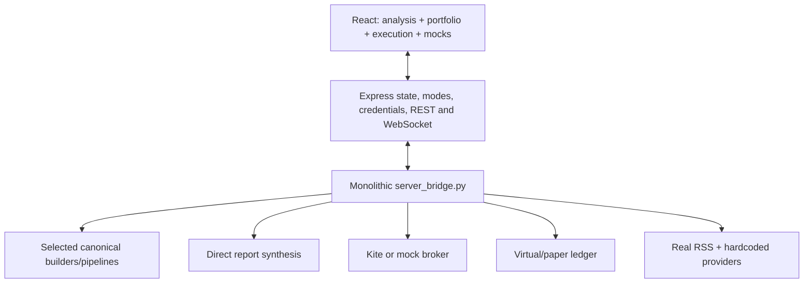
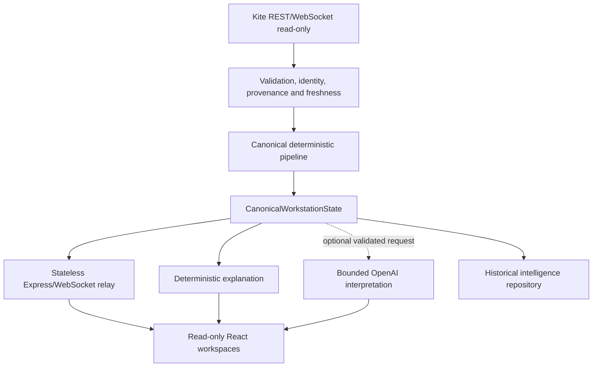

# AIR ArdhaMind Product–Architecture Alignment Review

## 1. Executive conclusion

AIR ArdhaMind should not continue toward the original execution roadmap. Its strongest and most defensible product is a **live, read-only NIFTY intelligence workstation**. The deterministic analytical core and most React presentation work should stay. Paper execution, portfolios, journals and order lifecycle should be extracted. Live execution surfaces should be removed. AI should be a bounded optional explanation service after canonical data quality is established.

## 2. What AIR ArdhaMind was

The original plan progressed from sample/mock/real analysis, to manually confirmed execution, and eventually to a supervised autonomous trading bot. Development stopped near the end of Phase 1 but incorporated early Phase 2 execution and portfolio concepts.

## 3. What it currently is

A broad React/Express/Python late-stage MVP with real Kite read connectivity, deterministic engines, paper simulation, execution-shaped UI, hardcoded/mock sources and a monolithic bridge. Runtime evidence includes:

- `server.ts:startPythonDaemon` and the in-memory `workstationState`
- `src/server_bridge.py:generate_dynamic_workspace_data`
- `WorkstationStateContext.tsx` WebSocket state ownership and large default contexts
- `BrokerService` selecting `MockBrokerGateway` or Kite from mode/configuration
- active order/exit routes in `server.ts`
- mock journal and local order lifecycle services
- canonical analytical engines that are only partially orchestrated live

## 4. What it will become

One user-facing operating profile: **LIVE INTELLIGENCE — READ ONLY**. It consumes trustworthy Kite data, validates freshness, runs deterministic NIFTY and option analysis, presents scenarios and invalidations, optionally explains them with bounded AI, records intelligence history, and never executes.

## 5. What stays

Models, indicators, options, market/trade context, scoring, opportunity, strategy suitability, confidence, risk V2, decision-support rules, deterministic explanation, intraday monitoring, planner summaries, operations health, read-only Kite integration, WebSocket delivery and most React visual components.

## 6. What changes

The bridge becomes thin; canonical pipelines become the only report producers; state becomes versioned/source-aware; Express becomes transport; React loses business defaults and modes; news uses only real providers; risk and planning language becomes scenario support rather than executable instruction.

## 7. What is extracted

Paper domain managers, virtual execution, paper portfolio/cash ledger, mock transactional broker, journal, order lifecycle, execution workspace and simulated-trade P&L analytics.

## 8. What is removed

Sample/mock/real user modes, live-trading controls, order/exit endpoints, mock data in production bundles, hardcoded publisher records, fake numeric fallbacks and execution-oriented navigation.

## 9. What is deferred

OpenAI interpretation, external alert delivery, professional charts, option ladder, durable historical store expansion, multi-broker support and all execution phases.

## 10. Final Phase 1 definition

AIR ArdhaMind is a read-only NIFTY intelligence assistant for a human trader. It supports real Kite market/broker reads; validated technical and option-chain analysis; market score, opportunity, strategy, confidence and risk outputs; trade scenarios; intraday monitoring; news; historical intelligence; deterministic explanation; and optional future AI narrative. It does not manage or execute trades.

## 11. Final architecture

### Current runtime

### Target runtime

### Canonical analytical flow

```mermaid
flowchart LR
  A[Validated Kite observations] --> B[MarketIntelligencePipeline]
  B --> C[MarketContext]
  C --> D[OptionIntelligencePipeline]
  D --> E[OptionContext]
  E --> F[TradeContextBuilder]
  F --> G[MarketScoringPipeline]
  G --> H[OpportunityPipeline]
  H --> I[StrategyPipeline]
  I --> J[TradePlannerPipeline]
  J --> K[ConfidencePipeline]
  K --> L[RiskPipeline]
  L --> M[DecisionPipeline / DecisionSupportReport]
  M --> N[Explanation and canonical state]
```

Mandatory stages are validation, market, option, trade context, score, opportunity, strategy, scenario, confidence, risk and decision support for a complete trade scenario. News and AI are optional. Missing news cannot fabricate neutrality; missing/stale market or required option quotes blocks dependent stages. No fake numeric fallback is permitted.

## 12. Final dashboard scope

The final workspaces are Market Command Center, NIFTY Price and Trend, Option-Chain Intelligence, Trade Assistant, Market Intelligence and News, Intraday Assistant, Historical Intelligence, System Health and Provenance, and Settings/Broker Connection. Portfolio, Execution and Trading Journal leave the product. Performance becomes intelligence history rather than simulated P&L.

## 13. Top ten architectural gaps

| Priority | Gap | Why/user risk | Affected areas | Recommended checkpoint |
|---|---|---|---|---:|
| P0 | Root Kite import shadowing | Mock behavior can masquerade as real broker data | `kiteconnect.py`, broker/data imports | 4 |
| P0 | No canonical source-aware state | Operator cannot establish truth/freshness | models, bridge, Express, React | 2 |
| P0 | Pipeline bypass/direct synthesis | Valid engines do not guarantee live output validity | `server_bridge.py`, pipelines | 3 |
| P0 | Fake/default data fallbacks | Plausible numbers survive missing inputs | option pipeline, React defaults, news providers | 3/5 |
| P0 | Execution surfaces exist | Read-only promise is not enforced | Express routes, UI, daemon commands | 5 |
| P1 | Mode and state duplication | Practice/trading/broker/feed state can disagree | workspace, Express, localStorage, React | 5 |
| P1 | Paper/live portfolio overlap | User cannot infer real versus simulated state | virtual execution, portfolio, journal | 5 |
| P1 | Monolithic bridge | Failures couple unrelated stages and resist testing | `server_bridge.py` | 3 |
| P1 | News real/static mixing | Hardcoded records appear current | news pipeline/providers | 5 |
| P1 | Missing professional data presentation | Analysis lacks chain/price context and provenance | React dashboard | 5/6 |

Additional P2 gaps: durable intelligence history, external alerts, option Greeks/skew, frontend tests and bounded AI. Execution, portfolio ledger and paper backtesting are out of scope or separate-product work.

## 14. Revised implementation order

1. Checkpoint 2: field provenance, canonical decisions and read-only state contract.
2. Checkpoint 3: application-service extraction and canonical pipeline integration.
3. Checkpoint 4: duplicate consolidation and official read-only Kite boundary.
4. Checkpoint 5: one product mode, production mock isolation, paper separation and frontend migration.
5. Later: historical intelligence, charts/option ladder, alerts and then bounded OpenAI explanation.

## 15. Execution de-scoping decision

- `/api/orders/place` and `/api/positions/exit`: remove or return an immutable read-only error; final preference is no route.
- Python `place_order`, `modify_order`, `cancel_order` daemon actions: reject as unsupported.
- Kite adapter methods: remain unimplemented/raise a dedicated read-only exception.
- `ExecutionWorkspace`: extract/remove from navigation.
- `ConfirmationManager`, order lifecycle and virtual positions: extract to paper application.
- Quantity calculation: may remain internal only if needed to explain risk, but must not be presented as an order quantity without separate owner approval.
- Broker orders/positions reads: retain only if needed for account awareness, clearly read-only and never mixed with scenario state.

Required negative tests must prove no UI control, Express endpoint, daemon command or broker method can place, modify, cancel or exit a position.

## 16. Product-owner questions

1. Should read-only account positions be visible at all, or should Phase 1 use Kite solely for market data and connection health?
2. Are provisional freshness thresholds in `data-quality-contract.md` acceptable, particularly the 15-second live hard block?
3. Should `DecisionReport` be renamed to `DecisionSupportReport` once compatibility migration permits?
4. Should risk output include illustrative sizing, or should all quantity fields be removed from Phase 1?
5. Is Google News RSS acceptable as the initial real news source, or is a licensed provider required?
6. Which historical intelligence must persist in Phase 1: raw observations, canonical snapshots, scenarios, narratives, or all four?
7. Should the future paper application receive copied code or repository history through a formal split?
8. Is OpenAI explicitly the preferred future provider, replacing the current Gemini branding/dependency?
9. Are in-app alerts sufficient for Phase 1, or is one external channel required?
10. Should market-closed mode show the last verified snapshot by default or require explicit user selection?

Implementation must not begin until the product owner approves the read-only definition, extraction boundary, freshness policy and revised checkpoint sequence.

