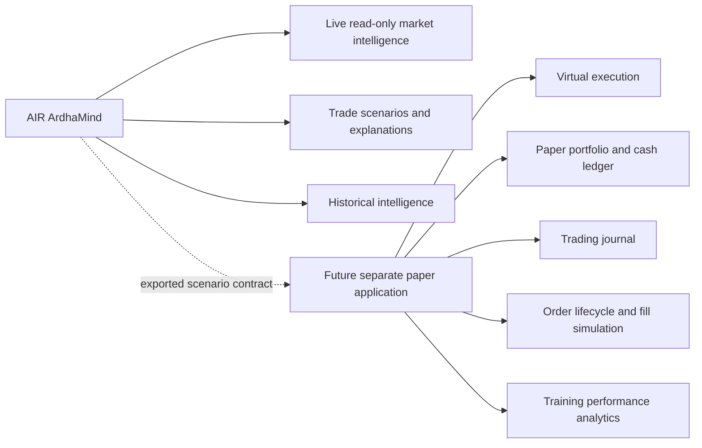

# Paper-Trading Extraction Plan

## Product boundary

AIR ArdhaMind should export or expose a versioned read-only trade-scenario contract. A future simulator may consume it, but simulator state must never return as AIR ArdhaMind live market truth.

## Assets to preserve for extraction

| Asset | Current use | Recommendation |
|---|---|---|
| `paper_trading/` | Entry, exit, portfolio, position, journal and performance domain | Preserve and later move to separate repository/application |
| `pipeline/paper_trading_pipeline.py` | Orchestrates paper managers | Extract with paper domain |
| `broker/services/virtual_execution.py` | Runtime virtual ledger | Reconcile with `paper_trading/`; choose one implementation in future app |
| `broker/adapters/mock_broker.py` | Mock transactional gateway | Test fixture now; future simulator adapter |
| `frontend/components/TradingJournal.tsx` | Static mock journal UI | Extract presentational shell; replace mock store in future app |
| `frontend/services/order_lifecycle.ts` | Browser-local lifecycle | Extract concepts, not current volatile implementation |
| `ExecutionWorkspace.tsx` | Order/exit UI | Extract for simulator only; never migrate to current product |
| `LivePortfolio.tsx` | Broker/virtual portfolio | Split: minimal broker health may stay; ledger UI extracts |
| `analytics_engine/` trade metrics | P&L and strategy analytics | Extract trade-performance portions; retain generic intelligence metrics if redesigned |
| Paper/execution tests | Regression fixtures | Preserve and relocate with extracted code |

## Transitional rules

1. Do not delete or move code until all imports are mapped.
2. Disable production entry points before physical extraction.
3. Keep paper tests green while isolating package boundaries.
4. Define a scenario export DTO with no execution callback.
5. The future app owns cash, fills, positions, orders and journal.
6. AIR ArdhaMind owns market observations, analysis snapshots and scenario history.
7. No shared mutable JSON portfolio file is permitted between products.

## Retirement sequence

1. Mark paper UI routes as outside the target navigation.
2. Prevent paper/mock providers from loading in live-readonly runtime.
3. Add import-boundary tests.
4. Create extraction manifest including files, tests and persistence formats.
5. Copy history into a future repository only after owner approval.
6. Remove original production imports after equivalence verification.
7. Archive remaining compatibility code.

No final name is assigned to the future paper application.

