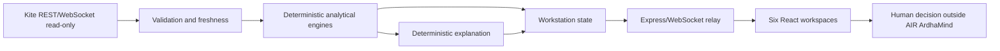

# Phase 1 Data Flow

```mermaid
flowchart LR
  K[Kite REST/WebSocket read-only] --> V[Validation and freshness]
  V --> E[Deterministic analytical engines]
  E --> X[Deterministic explanation]
  E --> S[Workstation state]
  X --> S
  S --> W[Express/WebSocket relay]
  W --> R[Six React workspaces]
  R --> H[Human decision outside AIR ArdhaMind]
```

Phase 1 changes the product shell and visibility boundaries. The full canonical state and pipeline migration remains the next architecture phase.

